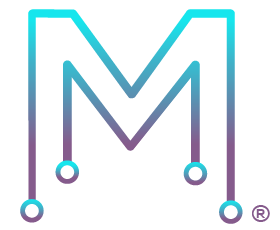

# Moore.io Client

The Moore.io Client is an open-source CLI tool designed to automate Electronic Design Automation (EDA) tasks encountered
during the development of ASIC, FPGA and UVM IP. This tool also serves as a client for the Moore.io Web Server,
providing functionalities such as installing IP dependencies, generating UVM code and packaging/publishing IPs.

## Why?
The EDA (Electronic Design Automation) field clearly lags behind in terms of Free & Open-Source (FOS) developer tools
when compared to the software world. There is no FOS tool that can drive the various CAD software and provide the
automation needed to produce commercial-grade FPGA and ASIC designs. Instead, homebrewed (and seldom shared) Makefiles
and Shell scripts rule the field of DevOps in semiconductors.

### The Problem
Writing a Makefile/Shell script that can perform all the tasks required for a Chip is a LARGE job. Since these languages
do not come with any meaningful libraries, the end result is usually a mess of patched, brittle code on which every
routine engineering task depends. This is sometimes compounded by copy-pasting the project Makefile/Shell script from
project to project; thus losing all Git history while commenting out old code and adding to the mess.

### The Solution
The Moore.io Client is a FOS Command Line Interface (CLI) tool implemented in Python 3, using Object-Oriented
practices, strong typing, unit testing, and a modular architecture that will be very familiar to UVM engineers (the
primary target audience of this tool). The client, invoked via `mio`, has all the features you'd expect from a
"Project Makefile" at a high-end Semiconductor engineering firm AND all the best features from Software package
managers:

 * The concept of a Project, which is identified by a `mio.toml` file in the root directory
 * A layered Configuration Space defined with TOML files (`mio.toml`) at the user (`~/.mio/mio.toml`) and project levels
 * Packaging of HDL source file into IPs (Intellectual Property) identified by `ip.yml` descriptors in their root directory
 * Performing tasks at the IP-level, including generating code, specifying and installing dependencies
 * Ability to drive all Logic Simulators (VCS, XCelium, Questa, Vivado, Metrics DSim, Riviera-PRO) with a single set of commands and parameters
 * A feature-driven Test Suite schema for specifying Regressions in UVM Test Benches, and the ability to run these Regressions on Job Schedulers (LSF, GRID Engine, etc.)

## How much does it cost?
The EDA Automation and Package management is Free & Open-Source. Some commands, such as UVM Code Generation, "phone
home" to the Moore.io Server and therefore require a User Account (which can be created at www.mooreio.com/register) and
a license for Datum UVMx. However, the tool operates independently of the site in all other regards and can be used
without authentication to build a Chip from start to finish. 


## Features

- Automation of most EDA tasks faced by ASIC, FPGA, and UVM engineers
- Management of IP dependencies
- Encryption & packaging of IP for delivery
- Publishing both commercial (keyed & encrypted) and Open-Source IP to the Moore.io Catalog
- Integration with Jenkins CI

## Installation

You can install `mio_client` via `pip`:

```sh
pip install mio_client
```

## Usage

```sh
mio <command> [<args>]
mio help <command>
```

For complete list of commands and options, you can use:

```sh
mio --help
```

## Documentation

Comprehensive documentation is available on [Read the Docs](https://readthedocs.org/projects/mooreio_client).

## Development

### Requirements

- Python 3.11.4
- `pip` package manager
- `make` utility (for convenience in development and CI)

### Setup

1. Clone the repository:
    ```sh
    git clone https://github.com/Datum-Technology-Corporation/mooreio_client.git
    cd mooreio_client
    ```

2. Set up Virtual Environment and install Dependencies:
    ```sh
    make venv
    ```

3. Run tests:
    ```sh
    make test
    ```

4. Build documentation:
    ```sh
    make docs
    ```

5. Build package:
    ```sh
    make build
    ```

6. Print Makefile User Manual:
    ```sh
    make help
    ```

## Continuous Integration
Most popular CI/CD tools are supported out-of-the-box. Some systems are better fleshed out than others; please don't
hesitate to contribute your tweaks!

### Supported Continuous Integration Tools
- Azure Pipelines
- Bamboo
- Bitbucket Pipelines
- CircleCI
- Codeship
- GitHub Actions
- GitLab CI/CD
- Jenkins
- TeamCity
- Travis CI

## Contributing

We welcome contributions! Please see the [CONTRIBUTING.md](CONTRIBUTING.md) file for guidelines on how to contribute.

## License

This project is licensed under the MIT License - see the [LICENSE](LICENSE) file for details.

## Contact

- Official site: [www.mooreio.com](http://www.mooreio.com)
- Copyright Holder: [Datum Technology Corporation](http://www.datumtc.ca)